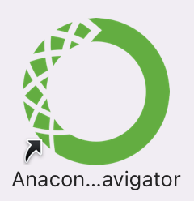
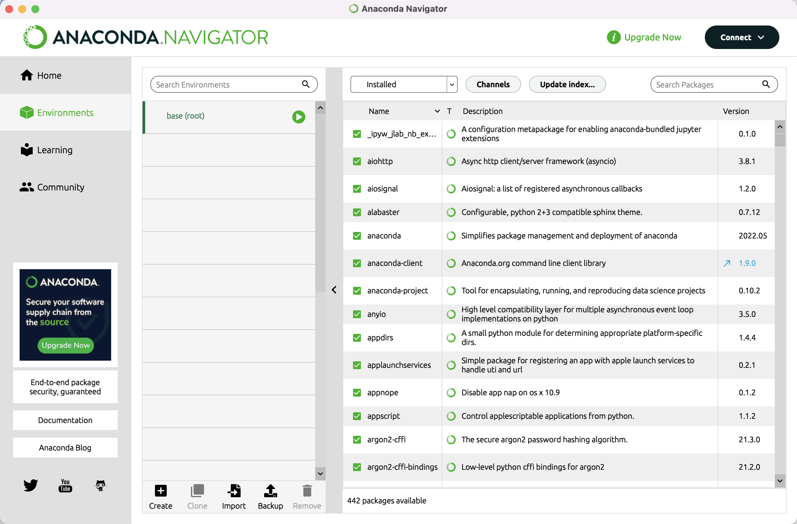
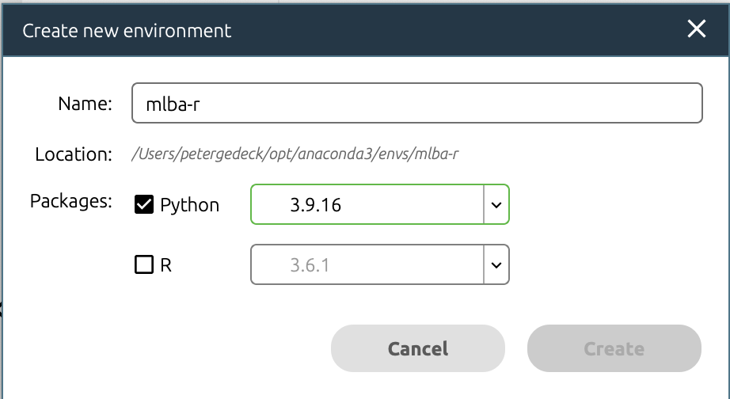
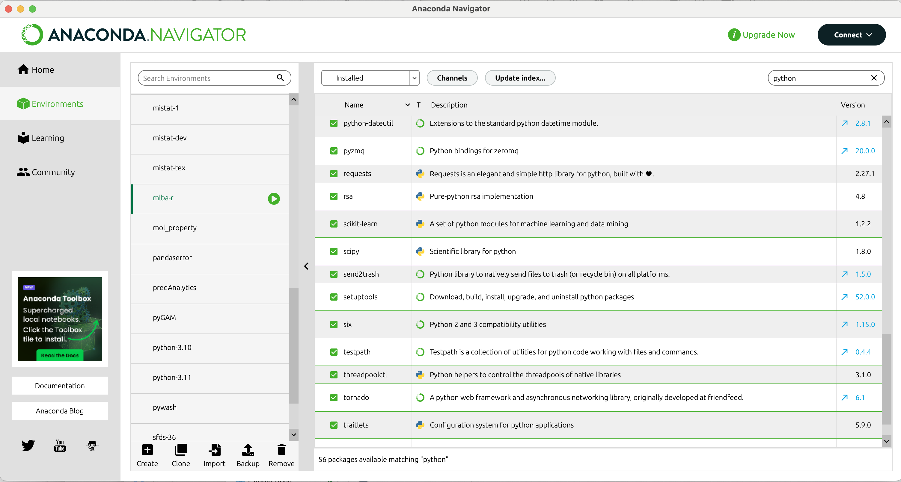

# Getting Started with Python
Python is a powerful, general purpose programming language that can be used for many applications ranging from short scripts to enterprise applications. There is a large and growing number of free, open-source libraries and tools for scientific computing. For more information about Python and its use visit [python.org.](https://www.python.org/).

## Install Python
There are many ways of using and developing with Python. However, a good start will be to use Jupyter notebooks, an interactive, browser-based Python interface available through the [Anaconda Distribution](https://www.anaconda.com/) which is particularly useful for scientific computing. We will be using Python 3.8 or newer. 

Here is what you need to do:

- Download the Anaconda installer for Python 3.8 or later from https://www.anaconda.com/download/ for your operating system (you will be asked for your email, however this step is optional and you can proceed without providing it)
- Execute the installer
  - macOS: double-click on the pkg file and follow the instructions using the default settings
  - Windows: run the exe file and follow the instructions using default settings
  - During installation of Anaconda, you are asked if you want to install DataSpell. This is optional, but can be a useful tool to get you started using Jupyter Notebooks.
  
Once the application is installed, you can execute Anaconda Navigator from the Start Menu (Windows) and the Application folder (macOS).

If you don’t want to use Anaconda, you will find installation instructions for Windows 10 at the end of this document.

## Anaconda Navigator – update and install packages 

You can use _Anaconda Navigator_ to manage your Python installation and run the Jupyter application. 

Use the _Environments_ tab to add packages to your Python installation. The package list looks like this:

To run the deep-learning applications from the book, we require a custom environment called `mlba-r`. It is in general a good idea to use custom Python environments for different projects to reduce the possibility of Python version conflicts and to have different Python versions on the same machine.

To create the `mlba-r` environment for the deep-learning applications from the book, click the **[+] Create** link at the bottom of the window. This will open a dialog where you can enter the name of the environment and the Python version. Enter `mlba-r` as the name and select Python 3.8 or newer as the version. Click the **[Create]** button to create the environment.

Click the [Update index…] button to refresh the package list. From time to time, it may ask you to update the Anaconda Navigator application. It’s good practice to update regularly. 
If new versions become available, you will see that the version number changes. The version number of updatable packages are highlighted in blue and with an arrow next to the version number.
This means that you can update the specific package. Change the pull-down menu to [Updatable] and click the green tick mark to select [Mark for update]. Do that for all the packages you want to update, select [Apply] and confirm the update. 

Once you initiated the update, use the [Clear] button to remove the marking. Anaconda Navigator otherwise will indicate that it is busy when you want to close the application. 

Updates are done in the background and will take some time and may require confirmation.  There is no feedback that an update is finished. You will need to refresh the list using [Update index…] to see the progress.

## Anaconda Navigator – install packages

To install a package, change the pull down to **[Not installed]** and enter e.g. tensorflow in the [Search packages] field. Click on the rectangle to select the package for download and use the [Apply] button to start the installation. 
Once the library is installed, it will be listed under the installed packages.

- tensorflow: Python package for the Tensorflow deep learning library(https://www.tensorflow.org/)
- keras: Python package for the Keras deep learning library (https://keras.io/)

**Advanced**: You can also install a library from the command line, which may be faster. Use the command:
`conda install packagename` 

## Further information
See https://gedeck.github.io/mistat-code-solutions/doc/installPython for more information about installing Python and the required packages.